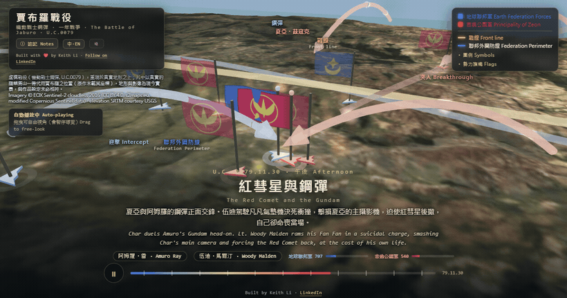

<div align="center">

# 賈布羅戰役 · The Battle of Jaburo

### A self-playing 3D documentary of Zeon's assault on the Earth Federation's hidden fortress, rendered on **real terrain** and built with an AI coding agent. A fan tribute to *Mobile Suit Gundam* (U.C. 0079).

[](https://keithligh.github.io/battle-of-jaburo-0079/)
&nbsp;
[](PROMPT.md)
&nbsp;
[](https://github.com/keithligh/battle-of-jaburo-0079)

[](LICENSE)
[](https://creativecommons.org/licenses/by/4.0/)
[](https://threejs.org/)
[](#run-it-locally)

[](https://keithligh.github.io/battle-of-jaburo-0079/)

**▶ [Try the live demo](https://keithligh.github.io/battle-of-jaburo-0079/)** &nbsp;·&nbsp; **📜 [Read the prompt that built it](PROMPT.md)**

</div>

---

**The Battle of Jaburo** is a fictional engagement from *Mobile Suit Gundam* (Sunrise, 1979). On 30 November U.C. 0079,
during the One Year War, the Principality of Zeon, led by Char Aznable, launches a surprise assault on the Earth
Federation's vast underground headquarters, Jaburo, and is repulsed. This replays it in 3D on **real-world terrain**:
real elevation, real satellite imagery, projected to scale. A camera **directs itself** through the battle, across the
two sides' forces, the period faction emblems, bilingual narration, weather, and a day/night cycle. **Every frame is
the live engine. Nothing is mocked up.** No build step, no backend, no API keys: one folder of static files that runs
in any browser.

This is a **non-commercial fan tribute**. *Mobile Suit Gundam* is © Sotsu, Sunrise. It is a *fictional* battle,
depicted faithfully to the established canon and openly sourced (see the
[research brief](Research_Brief_BattleOfJaburo.md)); the geography is a disclosed real-world stand-in (see
*Canon and accuracy* below).

> Every frame above is the live engine over real elevation and satellite imagery. Geography is a **present-day, real-world stand-in** for Jaburo; see *Canon and accuracy* below.

## Highlights

- 🌍 **Real Earth, to scale.** Actual SRTM elevation and Sentinel-2 satellite imagery, projected by real lng/lat. The Guiana Highlands (Mount Roraima / Kukenan), a disclosed real-world stand-in for Jaburo.
- 🎬 **It directs itself.** A cinematic "Director" plays the battle as a sequence of shots, from a wide reveal to a tight orbit around the Char vs Amuro duel; grab the camera any time to free-look, and it resumes.
- 🤖 **Forces sourced to canon.** Char's MSM-07S Z'Gok, the Mad Angler submarine squadron, the Gaw airdrop, Amuro's RX-78-2 Gundam, the mass-produced GM line, the beam batteries and Fly Manta interceptors, all on dated movement tracks, with the period faction emblems (the gold Sigil of Zeon on red, the Federation star-and-crescent).
- 🌧️ **Atmosphere.** Drop thrusters, beam fire, explosions, rain, a day/night cycle, and an original score.
- 🌏 **Bilingual.** 繁體中文 and English narration and labels throughout.
- ⚡ **Zero infrastructure.** No build, no backend, no API keys; runs offline from static files.
- 🤖 **Made with AI, in the open.** Built with Claude Code, and the originating brief is right here in the repo.

## Run it locally

Map tiles must be loaded over HTTP (same-origin). Opening `index.html` via `file://` will **not** work.

1. **Fetch the terrain and imagery tiles (first time only).** Requires **Node 18+**, cross-platform
   (Windows / macOS / Linux):
   ```
   node tools/fetch_tiles.mjs
   ```
   This downloads ~112 tiles (elevation and satellite imagery) for the Guiana Highlands bounding box from their source
   providers into `lib/tiles/`. No account or API key is required.

2. **Serve and open:**
   ```
   node tools/serve.js
   ```
   then open <http://localhost:5050>. (Windows: double-click **`start.bat`**; macOS/Linux: `sh start.sh`.) Click the
   music button (top-left) to unmute the score.

## How it works

- **Terrain:** AWS "Terrarium" elevation tiles (SRTM/USGS, public domain) decoded to a real height-mesh,
  Web-Mercator, to scale (with vertical exaggeration auto-derived from the real relief for legibility).
- **Surface:** EOX *Sentinel-2 cloudless 2016* satellite imagery draped over the terrain.
- **Direction:** a state-machine "Director" plays a fixed storyboard of shots; free-look pauses it.
- Everything is data-driven from `data.js` (forces, dated movement tracks, front lines, weather, storyboard,
  narration). `app.js` and its ES modules are the engine; `index.html` is the page.

## Build your own

This documentary is built on **[cinematic-3d-battle-engine](https://github.com/keithligh/cinematic-3d-battle-engine)**,
an open-source engine that renders any battle, historical or fictional, as a self-playing 3D documentary on real-scale
satellite and elevation terrain. You describe a battle in a data file and the engine renders it: no build, no backend,
no API keys. Clone the engine, follow its
**[PLAYBOOK](https://github.com/keithligh/cinematic-3d-battle-engine/blob/main/PLAYBOOK.md)**, and make your own.

## Licensing

- **Code** (the `.js` source, `index.html`, `tools/`): **MIT**, see [`LICENSE`](LICENSE).
- **Original narration, scenario data and text content:** **CC BY 4.0**,
  <https://creativecommons.org/licenses/by/4.0/>. This covers only this project's own writing, not the underlying
  *Mobile Suit Gundam* intellectual property, which is © Sotsu, Sunrise.
- **Bundled and fetched third-party software and data** (Three.js, Sentinel-2 imagery, SRTM/USGS elevation, the
  background music) retain their own licenses; see [`THIRD_PARTY_NOTICES.md`](THIRD_PARTY_NOTICES.md).

## Credits and data sources

- Satellite imagery: **Sentinel-2 cloudless 2016 © EOX IT Services GmbH** (s2maps.eu); contains modified
  Copernicus Sentinel data.
- Elevation: **SRTM, courtesy U.S. Geological Survey** via AWS Terrain Tiles.
- 3D engine: **Three.js** (MIT).
- Background music: *"Jaburo Assault"*, an original score generated with **Suno** (paid plan).
- Canon sources: *Mobile Suit Gundam* TV episodes 29–30 (Sunrise, 1979); The Gundam Wiki; Wikipedia; the *Gundam The
  Origin* official site. Full, cited list in [`Research_Brief_BattleOfJaburo.md`](Research_Brief_BattleOfJaburo.md).

## Canon and accuracy (please read)

This is an **illustrative, fictional reconstruction**, faithful to the *Mobile Suit Gundam* canon, not real history and
not an authoritative tactical record:

- **It is fiction.** Every force, commander and event is from *Mobile Suit Gundam* (Sunrise, 1979).
- **Geography is a real-world stand-in.** The original anime places Jaburo in the Amazon basin; later canon
  (*The Origin*) relocates it to the Guiana Highlands. This production uses the real **Mount Roraima / Kukenan** area as
  a stand-in. No official work gives coordinates, and the specific river the Zeon force ascends is this production's
  staging.
- **Timeline** follows the TV-anime single-day framing of 30 November U.C. 0079 (29 November prelude). Force and loss
  figures drawn from supplementary guidebooks are illustrative, not on-screen canon.
- **Emblems** are the One-Year-War faction insignia, drawn as simplified vector art for legibility. Both are fictional;
  neither is or resembles any real-world prohibited symbol.
- **Geography is present-day** satellite imagery and elevation, and need not match the work's setting.

## Author

Built by **Keith Li**. Find me on [LinkedIn](https://www.linkedin.com/in/keithlihk/).
